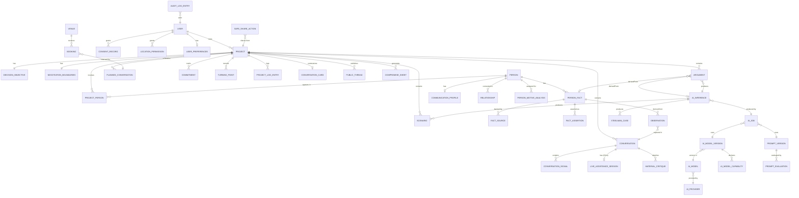

# Devil's Advocate — Implementation-Ready Specification v3

> ⚠️ **Конфиденциально.** Технический компаньон-документ к `devils-advocate-tz.md`. Коммерческая ценность та же — не подлежит разглашению третьим лицам без согласия автора.

**Статус:** первая ревизия. Покрывает ER-модель, API contracts, acceptance-тесты, capability gates и migration rules по итогам финального аудита ТЗ (18 закрытых P0-пунктов). Не заменяет продуктовое ТЗ — расширяет его до состояния, пригодного для оценки и старта разработки.

**Как читать этот документ:** раздел 1 — сущности и связи; раздел 2 — контракты API по модулям; раздел 3 — acceptance-тесты по ключевым флоу и P0-исправлениям; раздел 4 — capability acceptance tests (порог для перевода live-фич из EXPERIMENTAL в PROD); раздел 5 — MVP acceptance criteria; раздел 6 — AI evaluation gates; раздел 7 — migration rules и версионирование схемы.

---

## 1. ER-модель

### 1.1 Диаграмма связей (укрупнённо)



### 1.2 Ключевые сущности и поля

#### Пользователь и согласия

```
User
- id
- country, city                          // онбординг, 3.24
- religionId: nullable                   // default: null / "не указывать", без гео-дефолта
- reminderFrequency: everyLaunch|daily|off
- launchDisclaimerAcknowledgedAt
- disclaimerVersion
- preferences: { alwaysShowQuote, alwaysShowJoke }
- privacyProcessingMode: maximumPrivacy|balanced|maximumQuality   // 4.6

ConsentRecord
- id, userId
- consentType: recording|external_ai|ephemeral_server|location|religious_content|public_sharing|person_research|voice_processing
- version
- granted: bool
- grantedAt, revokedAt
- source                                 // экран/фича, откуда получено согласие
- scope                                  // projectId, если согласие не глобальное

LocationPermission
- userId, granted, grantedAt
- purposes[]                             // onboarding_city | weather | venue_search
```

#### Проект и цель решения

```
Project
- id, ownerId
- question, goal
- stages[]

DecisionObjective                        // 3.42, 1:1 с Project
- projectId
- desiredOutcome, idealOutcome, minimumAcceptableOutcome, unacceptableOutcome
- deadline
- constraints[], nonNegotiables[], negotiables[]

NegotiationBoundaries                    // 3.45, 1:1 с Project
- projectId
- idealOutcome, acceptableOutcome, batna, watna, walkAwayPoint

ProjectPerson                            // 3.38 — статус по проекту, не глобально
- projectId, personId
- status: persona|figurant
- statusChangedAt
- statusTrigger: manual|conflictDetectorSuggested
- statusConfirmedByUser: bool            // обязателен true перед сменой на figurant при триггере от детектора
```

#### Персона и факт-система (нормализованная, 4.2)

```
Person
- id
- communicationProfile: CommunicationProfile   // см. ниже, 3.11

PersonFact
- id, personId
- scope: project|person-global|private-to-user|public-derived-only   // default: project
- content
- sourceRefs[]
- sourceType: publicFact|personalRecord|userGuess   // AI-догадка не хранится как Fact, см. AIInference
- confidence
- status: active|disputed|expired
- createdAt, updatedAt, validFrom, validUntil, lastVerifiedAt
- visibility

FactSource                               // конкретная привязка факта к первоисточнику
- id, personFactId
- fileRef: nullable                      // локальная ссылка, файл не хранится на сервере (раздел 2)
- url: nullable
- conversationId: nullable
- timestamp

FactAssertion                            // конкретная формулировка факта в моменте (факт может переформулироваться со временем)
- id, personFactId
- assertedText
- assertedAt
- disputed: bool

Observation                              // 4.2b — сырое наблюдение до Fact/Inference
- id, sourceId, sourceType
- subject, content
- timestamp, speakerId
- confidence
- createdAt

CommunicationProfile                     // 3.11, заменяет personalityType
- personId
- prefersWritten, prefersDirectness, needsTimeToDecide, respondsToData
- conflictAvoidanceObserved, decisionStyleObserved
- каждый признак: { observedFrom[], confidence, lastObservedAt, userVerified }

Relationship                             // 3.13
- personA, personB
- type: family|hierarchy|social
- direction, strength
- confidence                             // добавлено по финальному аудиту — strength без confidence недостаточно

PersonMotiveAnalysis                     // 3.18, переработано под possibleInterpretations
- id, personId, projectId
- financialFactsRefs[]
- possibleInterpretations: [{ hypothesis, evidenceRefs[], alternativeExplanation, confidence, disputed }]
- goalAlignmentScore
- conflictPoints[], compromiseOptions[]
- researchRateLimitBucket                // для anti-abuse контроля, 3.18
```

#### AI provenance

```
AIInference                              // 4.2a — единый слой AI-вывода
- id
- output
- model, modelVersion, promptVersion
- sourceRefs[]
- inferenceType
- confidence, uncertainty
- userVerified, userDisputed
- createdAt

Argument
- id, projectId
- text
- derivedFrom: { personFactId: nullable, aiInferenceId: nullable }   // единственный provenance source
- sourceType: computed                   // вычисляется из derivedFrom, не хранится отдельно
- isPublic: bool
- lifecycleStatus: draft|tested|used|accepted|rejected|countered|expired|verified   // 3.58

Scenario                                 // 3.12
- id, projectId
- type: passive|adversarial|benevolent|custom
- description
- confidenceLevel: low|medium|high
- calibratedProbability: nullable        // заполняется только после накопления track record
- aiInferenceId
- basedOnPrecedents[]

SteelmanCase                             // 3.43
- id, projectId, personId
- strongestArgument
- supportingFactRefs[]
- reasonableness, whatUserMayMiss
- aiInferenceId

ConversationSignal                       // 4.2c — заменяет ContradictionFlag
- id
- signalType: factual_discrepancy|manipulation_pattern|probing_pattern|self_risk|emotional_shift|argument_acceptance
- speakerId, segmentRef
- confidence, evidenceRefs[]
- severity: inaccuracy|discrepancy|strong_discrepancy   // для factual_discrepancy
- probedTopic, repeatCount              // для probing_pattern
- userConfirmedIntentionalFalsehood: bool   // выставляется только пользователем
- disputed: bool
```

#### Разговоры, спарринг, планировщик

```
Conversation
- id, projectId
- occurredAt                             // только время, без координат
- inputType: audio|text
- rawFileLocalOnly: bool                 // true = LOCAL_ONLY, false = EPHEMERAL_SERVER использовался с согласием

PlannedConversation                      // 3.20
- id, projectId, personIds[]
- scheduledAt, estimatedDurationMinutes
- reminders: [{ type: pre-sparring|post-followup, offsetMinutes, sent }]
- weatherAdvice: { text, sourceType: aiGuess }   // опционально, 3.21

LiveAssistanceSession                    // 3.33 — статус EXPERIMENTAL до прохождения capability gates
- id, conversationId
- escalationScore: 0-100                 // внутренний, не отображается напрямую
- escalationCategory: calm|rising|high|critical   // отображается пользователю
- escalationTemporalAssociation: speakerId   // temporal, не causal
- breakingQuestion, compromiseQuestion
- updatedAt

LiveArgumentTracker
- sessionId, argumentId
- status: pending|mentioned|confirmed|needsRepeat
- confirmedGenuinely: bool

SparringSession                          // 3.26
- id, projectId
- personaType: figurant|archetype|custom
- personaConfig
- transcriptTurns[]
- audioPregenerated: bool

MaterialCritique                         // 3.27
- id, projectId
- materialType
- critiqueText, generatedPrompt
- iterationNumber, previousIterationId

CompromiseSheet                          // 3.41
- id, sparringSessionId
- phase: before|after
- items[]                                // ссылаются на Argument, не на PersonFact
- audioGenerated: bool
- audioSource: elevenlabs|userVoice
- postProcessing: { normalizeVolume, removePauses, removeNoise }
- previewedByUser: bool
- sentToFigurant: bool                   // не может стать true без previewedByUser=true

Commitment                               // 3.49
- id, projectId, personId
- owner: user|figurant
- description, dueDate
- status: pending|fulfilled|overdue
- extractedFromConversationId

TurningPoint                             // 3.50
- id, conversationId
- timestamp
- type: escalationShift|deescalationShift|positionShift
- description

ConversationCard                         // 3.44 — витрина, без собственных данных
- projectId
- topArguments[], batnaRef, openingScript, closingScript, doNotSayRefs[]

ConversationScript                       // 3.46
- id, projectId, personId
- type: opening|closing
- text
- basedOnCommunicationProfile: bool

ProjectLogEntry                          // 3.39 — UX-слой, отделён от AuditLogEntry
- id, projectId
- eventType: statusChange|escalationThreshold|signalRaised|signalResolved
- colorTone: green|red
- involvedPersonIds[]                    // обязательны при наличии colorTone
- description, sourceRef, createdAt
```

#### AI-инфраструктура

```
AIProvider(id, name, region, privacyPolicy)
AIModel(id, providerId, name)
AIModelVersion(id, modelId, version, releasedAt, deprecatedAt)
AIModelCapability(modelVersionId, taskType, modality, maxContext, structuredOutput, streaming, vision, audio, latencyClass, privacyClass, costClass, availability)

AIJob
- jobId, inputHash
- modelVersionId, promptVersionId
- status: queued|running|completed|failed|timeout|cancelled
- retryCount, retryPolicy, fallbackModel
- schemaValidation: pass|fail
- partialResult: nullable

PromptVersion
- promptId, version, template, changelog
- status: draft|testing|active|deprecated|rollback

PromptEvaluation
- promptVersionId, datasetVersion, metrics, passed, evaluatedAt

EvaluationDataset / EvaluationRun / EvaluationMetric / EvaluationResult / ReleaseGate
- используются для gate «Model/Prompt → Evaluation → Pass? → PROD/BLOCK» (раздел 6)
```

#### Приватность, аудит, шеринг

```
RetentionClass                           // 4.7
- classId: RAW_LOCAL|DERIVED_PRIVATE|AI_INFERENCE|PUBLIC_CONTENT|AUDIT_LOG|CONSENT_LOG|SHARE_LOG
- defaultRetention, userOverrideAllowed, legalHold, deletionBehavior

SafeShareAction                          // 3.48
- id, projectId
- contentType: compromiseSheet|publicThread|protocol
- previewShownAt
- detectedSensitiveItems[]               // {type, action: remove|alias|keep}
- sentAt, recipientContext
- shareToken: { entropy, expiresAt, revokedAt, passwordProtected, viewCount, lastViewedAt }

AuditLogEntry                            // 7.2 — append-only, отдельно от ProjectLogEntry
- id
- actorId, action, resource, resourceId
- timestamp, before, after
- requestId
- deviceMeta: nullable                   // только где юридически уместно

PublicThread                             // 4.5
- id, projectId, shareToken
- moderationQueue[]
- anonymousAllowed: bool

Venue / Booking                          // 3.22-3.23, ecosystem-слой, не core
- Venue: name, address, contacts, googlePlaceId, rating, reviewSummary, internalScore, status: pending|approved|rejected
- Booking: venueId, plannedConversationId, timeSlot, status
```

---

## 2. API Contracts

Стиль — REST поверх NestJS-модулей, JSON. Все мутирующие эндпоинты требуют `Authorization: Bearer <token>` (Telegram-native auth, `X-Telegram-Init-Data`, по паттерну, уже используемому в других проектах стека). Ниже — контракт по модулям, не полный OpenAPI, но достаточный для оценки и генерации схемы.

### 2.1 Projects & Decision Objective

| Метод | Путь | Описание | Тело запроса (сокр.) | Ответ |
|---|---|---|---|---|
| `POST` | `/projects` | Создать проект | `{ question, goal }` | `Project` |
| `GET` | `/projects/:id` | Получить проект + агрегаты (Open Loops, 3.59) | — | `Project & { openLoops }` |
| `PATCH` | `/projects/:id/objective` | Задать/обновить Decision Objective | `DecisionObjective` (без id) | `DecisionObjective` |
| `PATCH` | `/projects/:id/boundaries` | Задать BATNA/WATNA | `NegotiationBoundaries` (без id) | `NegotiationBoundaries` |
| `GET` | `/projects/:id/card` | Получить Conversation Card (3.44) | — | `ConversationCard` |
| `DELETE` | `/projects/:id` | Удалить проект (каскад, 7.2) | — | `204` |

### 2.2 People & Facts

| Метод | Путь | Описание | Тело/Параметры | Ответ |
|---|---|---|---|---|
| `POST` | `/projects/:id/people` | Добавить персону в проект | `{ name, initialStatus: persona }` | `ProjectPerson` |
| `PATCH` | `/projects/:id/people/:personId/status` | Изменить статус persona↔figurant | `{ status, confirmedByUser: true }` — **обязателен**, если триггер — детектор конфликта | `ProjectPerson` |
| `POST` | `/people/:id/facts` | Добавить факт о персоне | `{ content, scope: project, sourceType, sourceRefs[] }` | `PersonFact` |
| `POST` | `/people/:id/facts/:factId/promote-to-global` | Явный перенос факта в `person-global` (никогда не автоматически, 4.2) | — | `PersonFact` |
| `DELETE` | `/people/:id/facts/:factId` | Удалить конкретный факт (не всю персону) | — | `204` + каскад по 7.2 |
| `GET` | `/people/:id/stale-facts` | Устаревшие факты (Stale Fact Alert, 3.57) | `?olderThanDays=365` | `PersonFact[]` |

### 2.3 Arguments & AI Inference

| Метод | Путь | Описание | Тело/Параметры | Ответ |
|---|---|---|---|---|
| `POST` | `/projects/:id/arguments/generate` | Сгенерировать аргументы (за/против) | `{ engineId }` | `Argument[]` |
| `POST` | `/projects/:id/red-team` | Режим «Адвокат дьявола» (3.1) | `{ personId, engineId }` | `AIInference` |
| `POST` | `/projects/:id/steelman` | Steelman позиции фигуранта (3.43) | `{ personId, engineId }` | `SteelmanCase` |
| `POST` | `/projects/:id/missing-information` | Проверка недостающих данных (3.51) | — | `{ questions[] }` |
| `POST` | `/projects/:id/evidence-gap` | Разрыв доказательной базы (3.52) | — | `{ known[], supported[], assumed[], unknown[], contradictory[], stale[] }` |
| `POST` | `/projects/:id/scenarios/generate` | Прогноз по сценариям (3.12) | `{ scenarioTypes[] }` | `Scenario[]` |
| `POST` | `/projects/:id/best-next-move` | Рекомендованный шаг (3.54) | — | `{ bestAction, alternative, avoid, reason }` |

### 2.4 Conversations & Signals

| Метод | Путь | Описание | Тело/Параметры | Ответ |
|---|---|---|---|---|
| `POST` | `/projects/:id/conversations` | Создать запись о разговоре (метаданные, без файла) | `{ occurredAt, inputType }` | `Conversation` |
| `POST` | `/conversations/:id/upload` | Загрузить сырые данные — **обрабатываются согласно `privacyProcessingMode`, файл не персистится на сервере** | multipart, `{ processingConsent: bool }` при EPHEMERAL_SERVER | `{ transcriptId }` |
| `GET` | `/conversations/:id/signals` | Получить `ConversationSignal[]` | `?signalType=` | `ConversationSignal[]` |
| `POST` | `/conversations/:id/signals/:signalId/dispute` | Оспорить сигнал | — | `ConversationSignal` |
| `POST` | `/conversations/:id/turning-points` | Постфактум-детекция поворотных точек (3.50) | — | `TurningPoint[]` |
| `GET` | `/conversations/:id/do-not-say` | Информационная гигиена (3.17/3.53) | — | `{ items: [{say, doNotSay, why, saferAlternative}] }` |

### 2.5 Live Assistance *(EXPERIMENTAL — раздел 4, только за capability-gate)*

| Метод | Путь | Описание | Тело/Параметры | Ответ |
|---|---|---|---|---|
| `POST` | `/conversations/:id/live/start` | Начать live-сессию (доступно только если capability gate пройден, раздел 4) | — | `LiveAssistanceSession` |
| `WS` | `/live/:sessionId/stream` | WebSocket-поток индикатора накала и сигналов | — | events: `escalationUpdate`, `breakingQuestion`, `compromiseQuestion`, `signalDetected` |
| `POST` | `/live/:sessionId/end` | Завершить сессию | — | `LiveAssistanceSession` (final state persisted) |

### 2.6 Sparring & Compromise Sheet

| Метод | Путь | Описание | Тело/Параметры | Ответ |
|---|---|---|---|---|
| `POST` | `/projects/:id/sparring` | Начать AI-спарринг | `{ personaType, personaConfig }` | `SparringSession` |
| `POST` | `/sparring/:id/turn` | Реплика пользователя → ответ AI | `{ text | audioRef }` | `{ aiTurn, audioUrl? }` |
| `POST` | `/projects/:id/compromise-sheet` | Сгенерировать компромиссный лист | `{ phase: before|after }` | `CompromiseSheet` |
| `POST` | `/compromise-sheet/:id/voice/record` | Загрузить самозапись (суфлёр) | `{ postProcessing: {...} }` | `{ audioUrl, previewRequired: true }` |
| `POST` | `/compromise-sheet/:id/send` | Отправить фигуранту — **блокируется, если `previewedByUser != true`** | `{ recipientContext }` | через Safe Share (2.9) |

### 2.7 Scheduler

| Метод | Путь | Описание | Тело/Параметры | Ответ |
|---|---|---|---|---|
| `POST` | `/projects/:id/planned-conversations` | Запланировать разговор | `{ personIds[], scheduledAt, estimatedDurationMinutes }` | `PlannedConversation` |
| `GET` | `/calendar` | Календарь (неделя назад/вперёд) | `?from=&to=` | `PlannedConversation[]` |
| `GET` | `/projects/:id/scheduling-advice` | Умные советы (3.40) | — | `SchedulingAdvice[]` |

### 2.8 Privacy Center & Consent

| Метод | Путь | Описание | Тело/Параметры | Ответ |
|---|---|---|---|---|
| `GET` | `/privacy/overview` | Все данные пользователя одним экраном | — | сводка по RetentionClass |
| `POST` | `/privacy/consent` | Зафиксировать согласие | `ConsentRecord` (без id) | `ConsentRecord` |
| `DELETE` | `/privacy/consent/:type` | Отозвать согласие | — | `204` |
| `POST` | `/privacy/export` | Экспорт всех данных | — | `{ downloadUrl }` |
| `DELETE` | `/privacy/person/:id` | Удалить все данные о персоне (каскад, 7.2) | — | `204` |
| `DELETE` | `/privacy/fact/:id` | Удалить конкретный факт | — | `204` |
| `DELETE` | `/privacy/inference/:id` | Удалить конкретный AI-вывод | — | `204` |
| `POST` | `/privacy/share-links/revoke-all` | Отозвать все публичные ссылки | — | `{ revokedCount }` |

### 2.9 Safe Share

| Метод | Путь | Описание | Тело/Параметры | Ответ |
|---|---|---|---|---|
| `POST` | `/safe-share/preflight` | Privacy Preflight — детекция чувствительного контента | `{ contentType, contentRef }` | `{ detectedItems: [{type, value, suggestedAction}] }` |
| `POST` | `/safe-share/confirm` | Подтвердить действия по каждому пункту и отправить | `{ contentType, contentRef, actionsPerItem[] }` | `SafeShareAction` |
| `GET` | `/safe-share/log` | Журнал отправок | — | `SafeShareAction[]` |

### 2.10 AI Router (внутренний, admin-facing)

| Метод | Путь | Описание | Тело/Параметры | Ответ |
|---|---|---|---|---|
| `POST` | `/admin/ai-providers` | Зарегистрировать провайдера | `AIProvider` | `AIProvider` |
| `POST` | `/admin/ai-models/:id/capabilities` | Задать возможности версии модели | `AIModelCapability` | `AIModelCapability` |
| `POST` | `/admin/prompts` | Новая версия промпта (status: draft) | `PromptVersion` | `PromptVersion` |
| `POST` | `/admin/prompts/:id/evaluate` | Запустить evaluation gate | `{ datasetVersion }` | `PromptEvaluation` |
| `POST` | `/admin/prompts/:id/promote` | draft→testing→active (только после passed=true) | — | `PromptVersion` |

---

## 3. Acceptance-тесты по ключевым флоу

Формат Given/When/Then. Список не исчерпывающий — покрывает MVP-флоу и все 18 P0-исправлений финального аудита, чтобы каждое исправление было проверяемо, а не только описано текстом.

### 3.1 Decision Objective и Conversation Card (MVP)

```
Given пользователь создал проект без заполненной Decision Objective
When он открывает Conversation Card
Then система показывает предупреждение о недостающей информации (Missing Information, 3.51),
     а не генерирует карточку с пустыми полями
```

```
Given заполнены все поля Decision Objective
When генерируется компромиссный лист (3.41) с пунктом хуже walkAwayPoint
Then система явно предупреждает "предложенный компромисс хуже вашего BATNA",
     не включает его молча в список
```

### 3.2 Provenance и тегирование (P0 #2)

```
Given аргумент создан на основе AIInference с confidence < порога
When пользователь открывает карточку аргумента
Then sourceType вычисляется как 🟡 "догадка ИИ" из derivedFrom.aiInferenceId,
     отдельного независимого поля sourceType в БД не существует
```

```
Given один и тот же Argument.derivedFrom одновременно ссылается на personFactId И aiInferenceId
When выполняется валидация при сохранении
Then запрос отклоняется — derivedFrom обязан ссылаться ровно на одну сущность
```

### 3.3 Факт-система и FactScope (P0, закрыт в v2, регрессионный тест)

```
Given пользователь зафиксировал факт о персоне X в проекте "развод" со scope=project
When он открывает другой проект "переговоры о работе" с той же персоной X
Then этот факт НЕ появляется автоматически в базе фактов второго проекта
```

```
Given пользователь явно вызывает /people/:id/facts/:factId/promote-to-global
When действие подтверждено
Then facts.scope меняется на person-global и становится виден в обоих проектах
```

### 3.4 ConversationSignal вместо ContradictionFlag (P0 #1)

```
Given детектор расхождений, детектор манипуляций и детектор прощупывания работают на одном транскрипте
When генерируются сигналы
Then все три создают записи в единой таблице ConversationSignal с разными signalType,
     ни одна фича не создаёт legacy-таблицу ContradictionFlag
```

### 3.5 Шкала расхождений и запрет вывода умысла (уже закрыто, регрессия)

```
Given обнаружено расхождение утверждения с публичным фактом без прямой ссылки-источника
When генерируется ConversationSignal
Then severity не может быть выше "inaccuracy" — "discrepancy"/"strong_discrepancy" требуют evidenceRefs[] непустой
```

```
Given severity = strong_discrepancy
When рендерится UI
Then текст всегда в форме "утверждение расходится с источником X",
     userConfirmedIntentionalFalsehood остаётся false, пока пользователь не установит его вручную
```

### 3.6 Motive Analysis как гипотезы (P0 #10)

```
Given система анализирует имущественное положение фигуранта
When генерируется PersonMotiveAnalysis
Then результат — массив possibleInterpretations[], каждая запись содержит
     hypothesis + alternativeExplanation + confidence,
     единственного поля "inferredGoal" не существует в схеме
```

### 3.7 Person → Figurant требует подтверждения (P0 #11)

```
Given детектор конфликта целей (3.18) обнаружил конфликт интересов для персоны, имеющей статус persona
When срабатывает детектор
Then статус в ProjectPerson остаётся persona, создаётся только предложение смены статуса;
     UI показывает баннер "предлагаем сменить статус на фигурант — подтвердить?"
And статус меняется на figurant только через PATCH /people/:id/status с confirmedByUser=true
```

### 3.8 Religion default (P0 #12)

```
Given новый пользователь проходит онбординг, определена страна = Украина
When открывается экран выбора вероисповедания
Then поле показывает "Не указывать" как выбранное значение по умолчанию,
     список конфессий не предзаполнен и не подсвечен как "вероятный" вариант
```

### 3.9 Privacy Processing Mode wording (P0 #17)

```
Given пользователь начинает запись разговора на устройстве, не поддерживающем on-device STT
When запускается транскрибация
Then приложение показывает явный диалог согласия "для этого анализа аудио будет временно
     отправлено на сервер и удалено сразу после обработки" ПЕРЕД отправкой,
     а не отправляет тихо
And ConsentRecord с consentType=ephemeral_server создаётся с привязкой к этой конкретной операции
```

### 3.10 Emotional observation vs interpretation (P0 #9)

```
Given зафиксирована пауза длиной 3.2 секунды в речи говорящего
When генерируется сигнал (signalType: emotional_shift)
Then Observation содержит "пауза 3.2 сек" как измеримый факт,
     AIInference поверх него содержит "возможное колебание" как отдельное помеченное поле,
     UI никогда не показывает одну слитую строку без разделения источника
```

### 3.11 Safe Share Preflight (закрыто, регрессия + расширение P0)

```
Given компромиссный лист содержит телефон, имя и приватный факт
When вызывается POST /safe-share/preflight
Then ответ перечисляет каждый обнаруженный элемент с предложенным действием (remove/alias/keep)
And POST /safe-share/confirm отклоняется, если actionsPerItem[] не покрывает все detectedItems
```

### 3.12 Deletion cascade (P0 #7)

```
Given персона удаляется через DELETE /privacy/person/:id
When выполняется удаление
Then каскадно удаляются PersonFact → FactAssertion → FactSource,
     связанные AIInference получают статус source_unavailable (не удаляются молча),
     Argument, производные от этих AIInference, остаются только если позволяет RetentionClass.legalHold
```

### 3.13 Capability-gate для Live Assistance (P0 #8, раздел 4)

```
Given фича Live Assistance помечена статусом EXPERIMENTAL
When запрашивается POST /conversations/:id/live/start на платформе, не прошедшей acceptance test
     (например, TMA без подтверждённой поддержки потокового аудио)
Then запрос отклоняется с явным сообщением о недоступности на этой платформе,
     а не деградирует молча до неработающего интерфейса
```

### 3.14 Secrets management (P0 #16)

```
Given администратор регистрирует нового AI-провайдера
When вызывается POST /admin/ai-providers с полем apiKey
Then apiKey никогда не сохраняется в таблице AIProvider — только credentialRef,
     сам ключ уходит в secret manager
```

### 3.15 Честный постфактум без токсичности (P1 #34)

```
Given цель проекта не достигнута
When генерируется завершающее сообщение (3.35)
Then текст называет конкретную вероятную причину неудачи без обвиняющих/уничижительных формулировок
     ("цель не достигнута — аргумент X не сработал, стоит проверить Y" — допустимо;
     "вы плохо провели разговор" — недопустимо, тест на токсичность блокирует такую генерацию)
```

---

## 4. Capability Acceptance Tests (раздел 9.1 ТЗ)

Перед переводом live-зависимых фич (3.33, часть раздела 2) из `EXPERIMENTAL` в `PROD` — обязательное прохождение по каждой платформе:

| Capability | Platform | Test | Expected | Status |
|---|---|---|---|---|
| Микрофон в TMA | TMA/Web | Запись 5-минутного разговора без сбоя | Полная запись без потери сегментов | ⬜ не протестировано |
| Потоковая передача аудио | TMA/Web | Стриминг в Web Worker при активном экране | Задержка приёма < целевого порога | ⬜ |
| Фоновая обработка | Android/iOS | Сворачивание приложения во время записи | Запись продолжается или явно останавливается с уведомлением | ⬜ |
| On-device STT | Android/iOS/Desktop | Транскрибация 10-минутной записи локально | WER (word error rate) ниже целевого порога | ⬜ |
| Производительность Web Worker | TMA/Web | Обработка при слабом устройстве (низкий класс CPU) | Не блокирует UI-поток дольше целевого порога | ⬜ |
| Длинная запись | Все | Запись 60+ минут без сбоя | Файл цел, метаданные консистентны | ⬜ |
| Live-задержка end-to-end | TMA/Web, Native | От речи до обновления индикатора накала | p95 < целевого порога | ⬜ |
| Push через Telegram Bot API | Все | Доставка напоминания планировщика (3.20) | Доставлено в течение целевого окна | ⬜ |
| Нативная запись звонка | Android/iOS Native | Попытка записи сотового звонка | Либо работает легально в юрисдикции, либо явно недоступно | ⬜ |

**Числовые целевые пороги (latency/WER/battery) определяются на этапе технического проектирования до старта разработки live-фич — не задаются в этом документе как плейсхолдеры, чтобы не создавать ложное впечатление уже принятого решения.**

---

## 5. MVP Acceptance Criteria

MVP (раздел 6 ТЗ, v1) считается готовым к релизу, если выполнено:

1. Пользователь может создать проект, задать Decision Objective, добавить минимум одну персону и получить сгенерированные аргументы за/против с обязательным тегом источника.
2. Red Team (3.1) и Steelman (3.43) доступны для минимум одного фигуранта в проекте.
3. Conversation Card (3.44) собирает Decision Objective + топ-аргументы + BATNA/WATNA + opening/closing script + Do Not Say в одном экране без ошибок при пустых необязательных полях.
4. Privacy Center (3.47) отображает как минимум: локальное хранение, статус геолокации, список персон с возможностью удаления, экспорт данных.
5. Safe Share Preflight (3.48) обязателен перед любой первой отправкой контента вовне — попытка обойти preflight технически невозможна на уровне API (сервер отклоняет запрос без прошедшего preflight-шага).
6. Обязательный дисклеймер при первом запуске (3.36) заблокирован до подтверждения — недоступен основной интерфейс без acknowledgment.
7. AI-движок выбираем минимум из одного варианта, архитектура `AIEngineProvider`/`AIJob` готова принять дополнительные движки без релиза кода.
8. Все выходные данные, помеченные как AI-вывод, физически не могут быть сохранены в БД как `PersonFact` — валидация на уровне схемы/ORM разделяет `AIInference` и `PersonFact` как разные таблицы.

---

## 6. AI Evaluation Gates

Ни одна модель или промпт не помечается `active` до прохождения:

```
PromptVersion.status = testing
        ↓
PromptEvaluation запускается на EvaluationDataset
        ↓
EvaluationMetric считается (accuracy / precision / recall / hallucination rate — по типу задачи)
        ↓
passed = true/false относительно ReleaseGate-порога
        ↓
   ┌────┴────┐
  true      false
   ↓          ↓
active    остаётся testing, разработчик получает отчёт с деталями провала
```

**Обязательные gate для высокорисковых AI-фич** (без исключений, независимо от общего relase-процесса):
- Детектор расхождений/уловок/прощупывания (`ConversationSignal`) — минимальная точность распознавания на held-out датасете, максимальный порог false positive для `strong_discrepancy`
- Мотивный анализ (`PersonMotiveAnalysis`) — каждая гипотеза в тестовом наборе обязана иметь `alternativeExplanation`, иначе gate не пройден
- Прогнозы по сценариям (`Scenario`) — калибровка `calibratedProbability` не активируется, пока датасет исходов меньше минимального размера выборки (определяется на этапе технического проектирования)

---

## 7. Migration Rules и версионирование схемы

Проект без предшествующей production-базы (pre-launch), поэтому классической миграции существующих пользовательских данных нет. Тем не менее фиксируются правила на будущее, так как модель данных уже прошла две ревизии внутри самого процесса проектирования (см. историю аудитов):

1. **Semantic versioning схемы**: каждое breaking-изменение модели данных (переименование поля, смена типа, удаление сущности) сопровождается номером схемы (`schemaVersion`) и явной migration-функцией, а не тихой заменой поля.
2. **Deprecated-поля не удаляются мгновенно**: поле помечается `@deprecated` минимум на один релизный цикл с логированием использования, прежде чем физически удаляется из схемы — это правило прямо мотивировано историей `ContradictionFlag → ConversationSignal` и `personalityType → communicationProfile` внутри этого же проекта.
3. **Обратная совместимость API**: изменения контрактов раздела 2 версионируются через префикс пути (`/v1/...`, `/v2/...`) при breaking-изменениях, а не через модификацию существующего эндпоинта.
4. **Каждая новая AI-модель или промпт проходит evaluation gate (раздел 6) перед тем, как заменить текущую активную версию** — откат на предыдущую `PromptVersion`/`AIModelVersion` должен быть одной операцией, не восстановлением из бэкапа.

---

## 8. Что осознанно не входит в эту ревизию

Согласно рекомендации финального аудита (раздел 46 исходного аудита) — эта ревизия не добавляет новых продуктовых фич. Не включено намеренно:

- Конкретные числовые SLA/пороги производительности (latency, WER, battery) — определяются на этапе технического проектирования с реальными измерениями на целевых устройствах, а не как гипотетические цифры в документе
- Полная OpenAPI/Swagger спецификация со всеми полями и кодами ошибок — этот документ даёт контракт уровня, достаточного для оценки трудозатрат и построения ER-диаграммы; полная спецификация — задача первого спринта разработки, синхронизированная с фактической реализацией
- Team/B2B authorization contract в деталях — Authorization Matrix (7.2 ТЗ) даёт принцип, полная ролевая модель проектируется вместе с самой фичей командного режима (3.6), которая остаётся в v4
